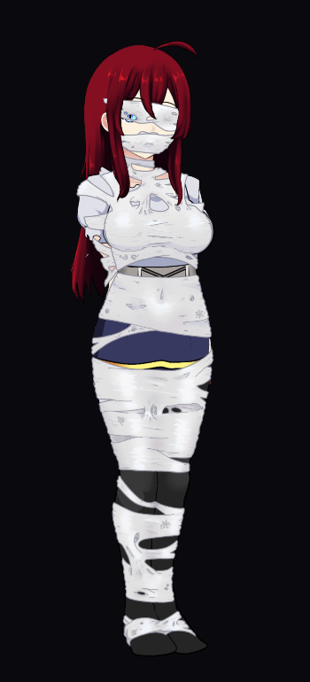
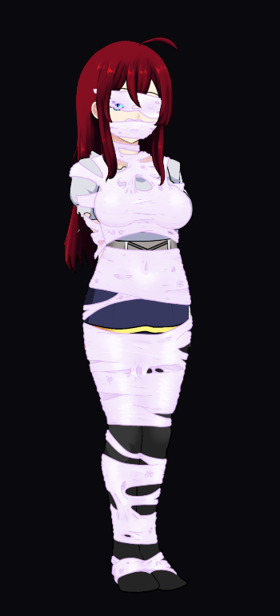
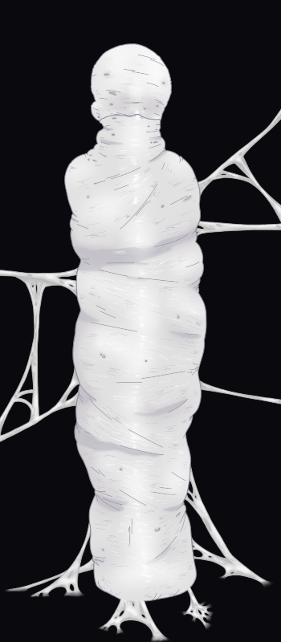

# Spiderlings 0.92.34

It's been a while since the last rework. During this time, **T_Swizzle helped create brand-new, hand-drawn artwork, replacing the AI-generated art from the initial rework.**

There are **three tiers of webbing restraints and a final Cocoon form**, all with switchable original and pink colors.

**Jumpers have a new leap attack, and Web Casters have learned to work together.**

**Spider infestation floors** can randomly appear from floor 3 onward. **Maidforce will hunt spiders and clear their nests.**

A variety of **Mod options** lets you adjust the difficulty to your liking.

Try **Silken Awakening**, a new starting perk that puts you in the full webbing set and Cocoon.

Tested locally on **KD 5.4.92**. The **5.5 GitHub development build** is currently supported, but compatibility with future updates is not guaranteed. Please start a new save when upgrading from the old AI-art version.

Thank you to **T_Swizzle** for the artwork and **anthropocentricity**, the original Mod author!

If you encounter any bugs or have suggestions, **feel free to leave a comment and share screenshots!**

[Download 0.92.34](../Spiderlings_0.92.34.zip)

